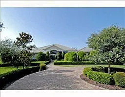
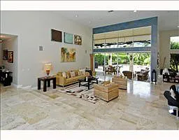
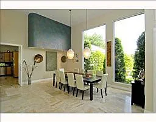
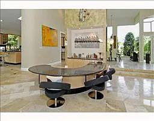
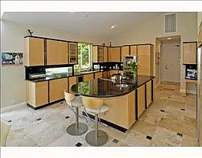

## Mark Wilson
Mark Wilson transferred into our school in the second grade. His dad ran a hotel chain and rented out houses to move around the world bringing his family with him. Mark was an interesting person obsessed with saving animals. I remember the first interaction we had was after he had to give a report about the animals in the rainforst. Yes, at such a young grade we were doing this. The school started students off for success and made sure they were focused on achieving goals. Mark promised he was going to create a sanctuary to save animals. We then started talking about what animals he had at his house. This was a common theme with Mark, getting new pets and helping to raise them. It inspired me to get my first hamster in the 4th grade but it never worked out, I was more of a dog person anyways. 

Mark was outgoing and charismatic however, he often got into arguements with his parents while we were young. I do believe this came from the way he was raised, getting everything that he wanted. Looking back I believe this was the way Ken made up for travelling all the time. Running a hotel and constantly needing to be on the premises made it hard for him to spend time with his family. Mark often got what he wanted and this sometimes caused us to have arguments when it came to trading cards or if I beat him too badly in a game. However we always made up, sometimes it just took a bit longer. But thats how boys are, we argue and sometimes we are just plain mean to eachother. But we always come back and make up, even if nothing is really said about it, we don't hold any grudges or issues. 
### Mark's house
while it didn't look like this when we were young, remodels from the new owners and sale of the property. Marks house was located at 12100 NW 7th St, Plantation, FL 33325. 

Mark's house was amazing, it was this 4000+ square foot house with tile flooring an open concept and glass panels through the front entrance and back patio. The back patio was an enclosed area and lead to a pool where we would spend most of our time when we weren't playing games as kids. The patio housed for birds, rats(pets), and a gerbils along with an air hockey table. Mark was constantly outside taking care of his animals or bringing one of them in while we were watching shows or playing games. 

Mark's house also had a huge kitchen and right next to it was his game room where he had his snake (not a fan) and an old style recliner from the 80s a palish red color that he played games on. On the other side of the house, he had his personal bedroom with a water bed and an office off of his bathroom. In the early years when we first met, this was where his dad Ken worked but it would later be a place where he did his homework (when his mom didn't do it for him) as the years progressed. There was also a grandfather clock that sat in that hallway, that would always tell us we were up way to late. Right next to his bedroom before entering the hallway it branched off into his parents room, this is where we would spend most of our time looking at pokemon cards and yugioh cards later when it came out. 

## Growing up with Mark
I was constantly over at marks house, I remember being there almost every weekend playing games and enjoying our time together. Brennan lived a bit farther away but since mark had free reign over his house he could constnatly have people over. Oh man, when Brennan and I was over on a weekend we would just go over to marks on a Friday and stay until sunday evening, we had fun running around playing card games watching pokemon or other saturday morning TV shows, playing playstation or N64. Mark's parents drove us around when we wanted to go see a movie that came out or when we wanted to go to best buy to look around for new electronics. They even ran us over to haunted houses because they wanted us to go out more, but that didn't stop us. We would be up till 6am most nights just having the time of our lives as kids. 

One weekend, we even build a fort in the garage where his parents had all of their stored boxes and hooked up the N64 out there to play concurs bad fur day. Mark is family, another brother to me.  