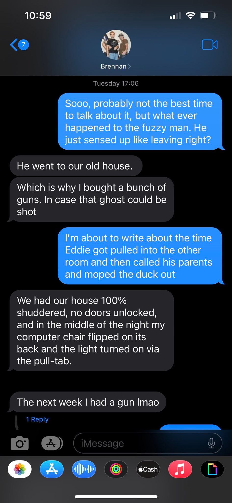
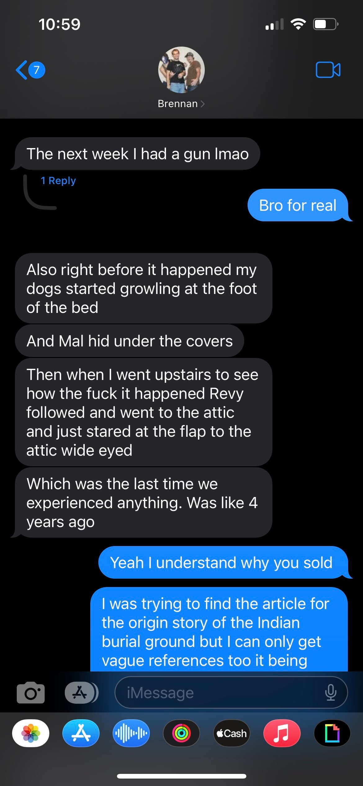
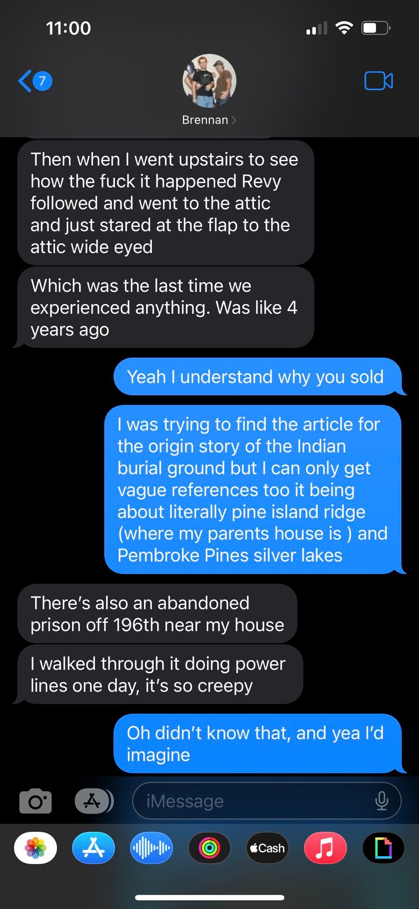

#### Hauntings
I understand it is hard to believe in this, honestly if I hadn't experienced some of what I did I wouldn't either. At Brennan's house the room next to his was used as a guest room or strage. The door was always closed, sometimes even locked. However, the door would always be open when we would get up. In the middle of the night you could hear footsteps walking from that door to the loft, slowly. There was also the eddie incident. Eddie was a friend we made in 7th grade so this is a bit outside of the epoch scope, however it is one of the extreme examples we have. Prior to the sleepover, eddie never believed us when we talked about the fuzzy man. what we would call this mysterious figure we would see in the hallway. However, that day when he came over he was taunting him asking him to show him that he was real and after going into that room during the day seeing that there was no issue he just kept saying, "I told you there is nothing there." That night, however, he was forcefully pulled into the hallway. Hard enough to jerk him away and make him panic thinking that one of us were playing a trick on him. But, we were all asleep next to him on the floor or in the bed. After that he woke all of us up, called his parents to come get him at 2AM and went home not wanting to stay there that night. 

Remembering this, I asked Brennan what had happened to him and aparently he is following Brennan around. The spirit seems to have followed brennan to his new house and caused an issue there. Brennan says it best when explaining what happened, I have attached the text messages. 

