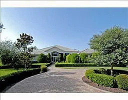
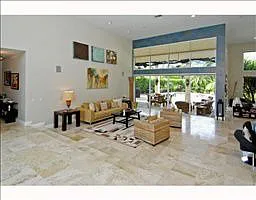
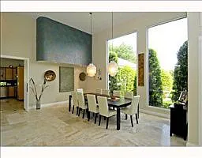
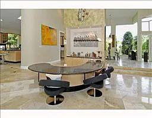
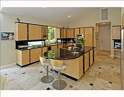

# Lower School
While I don't remember much from these times, I remember having a family that would help me celebrate. And that I made life time long friends along the way. In first grade, my parents held me back one year to make sure that I wasn't the youngest in the grade. I also started a new school, transfering from a school called Sunny land. They wanted me to have the best opportunities avaialble. 

## Brennan Silecchia
Heading into American Heritage school in plantation Florida in first grade, starting without knowing anyone was a challenge. I remember the first day being terrified and having to be walked by my dad to the classroom. The class was on the backside of the building next to a courtyard facing a canal. The classroom was warm and welcoming, there were plants growing on the window and the alphabet along the wall just below the ceiling. 

It was these first few days that I first met Brennan Silecchia, by denying him one of my penciles. Even though I had probably 100 of them in a box, ever caring mother making sure I was prepared. Then one day when I forgot my book, the teacher paired us together in that first grade class. From that point on we were always together. Either walking in line to from the cafeteria to the classroom or running around on the playground together. I still to this day don't understand why I would do that, but I mean kids are selfish. They tend to keep what they are given and cry about it if its taken away. 

Brennan is one of the most important people in my life at that point and still is. He is family, a brother and I wouldn't hesitate to say that to anyone. It's crazy to think back at that point to realize how far we would go together and the hardships we faced along the way. Honestly, first grade is all a blur at that point, but I remember meeting him, and he still remembers this as well to this day. Though we didn't hang out much after school, I assume because we were still young at that point, it would change in later grades when Mark Wilson would come along.

## Mark Wilson
Mark Wilson transferred into our school in the second grade. His dad ran a hotel chain and rented out houses to move around the world bringing his family with him. Mark was an interesting person obsessed with saving animals. I remember the first interaction we had was after he had to give a report about the animals in the rainforst. Yes, at such a young grade we were doing this. The school started students off for success and made sure they were focused on achieving goals. Mark promised he was going to create a sanctuary to save animals. We then started talking about what animals he had at his house. This was a common theme with Mark, getting new pets and helping to raise them. It inspired me to get my first hamster in the 4th grade but it never worked out, I was more of a dog person anyways. 
### Mark's house
while it didn't look like this when we were young, remodels from the new owners and sale of the property. Marks house was located at 12100 NW 7th St, Plantation, FL 33325. 

Mark's house was amazing, it was this 4000+ square foot house with tile flooring an open concept and glass panels through the front entrance and back patio. The back patio was an enclosed area and lead to a pool where we would spend most of our time when we weren't playing games as kids. The patio housed for birds, rats(pets), and a gerbils along with an air hockey table. Mark was constantly outside taking care of his animals or bringing one of them in while we were watching shows or playing games. 

Mark's house also had a huge kitchen and right next to it was his game room where he had his snake (not a fan) and an old style recliner from the 80s a palish red color that he played games on. On the other side of the house, he had his personal bedroom with a water bed and an office off of his bathroom. In the early years when we first met, this was where his dad Ken worked but it would later be a place where he did his homework (when his mom didn't do it for him) as the years progressed. There was also a grandfather clock that sat in that hallway, that would always tell us we were up way to late. Right next to his bedroom before entering the hallway it branched off into his parents room, this is where we would spend most of our time looking at pokemon cards and yugioh cards later when it came out. 